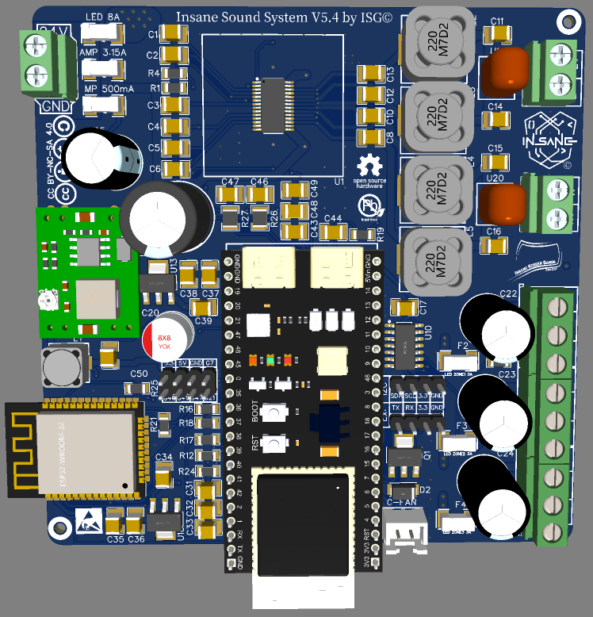
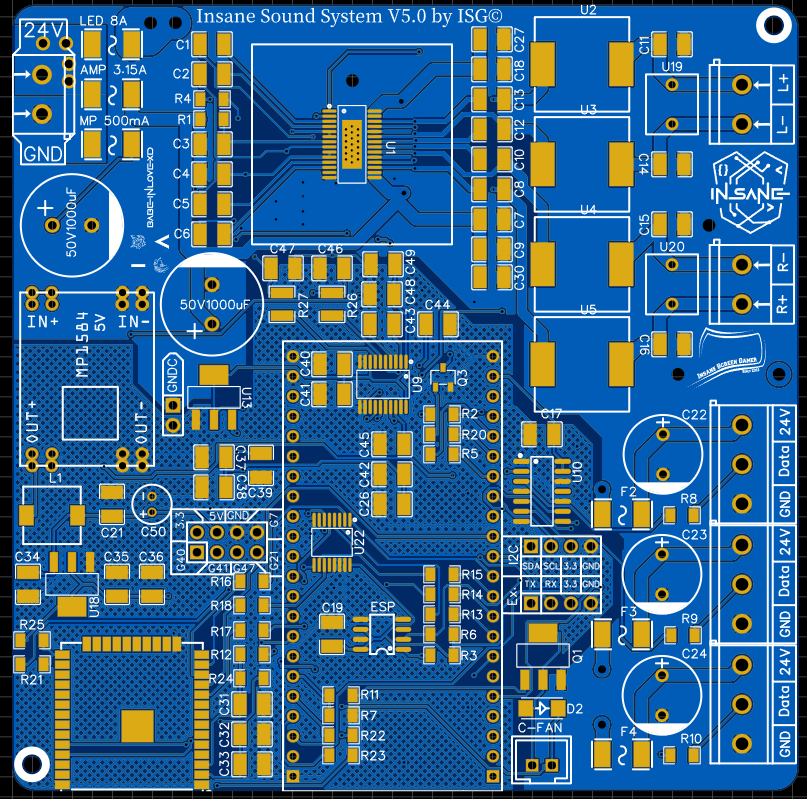
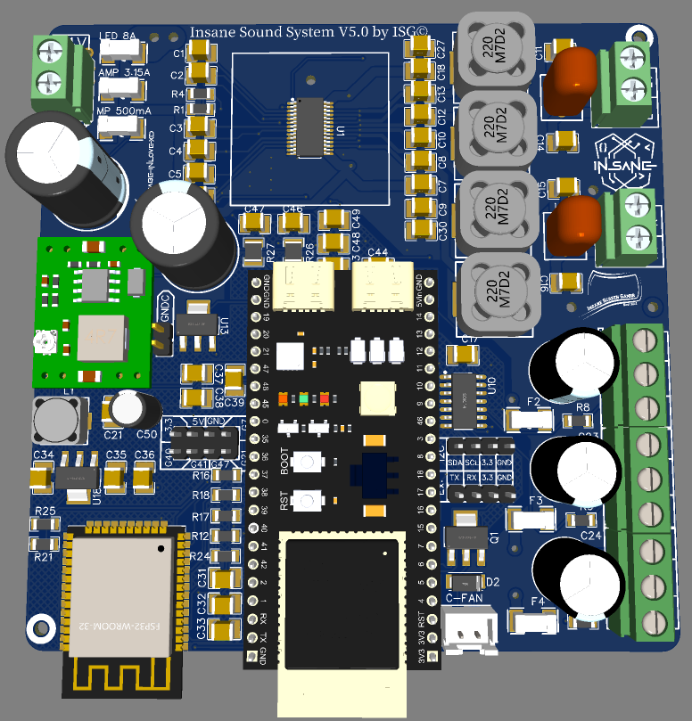
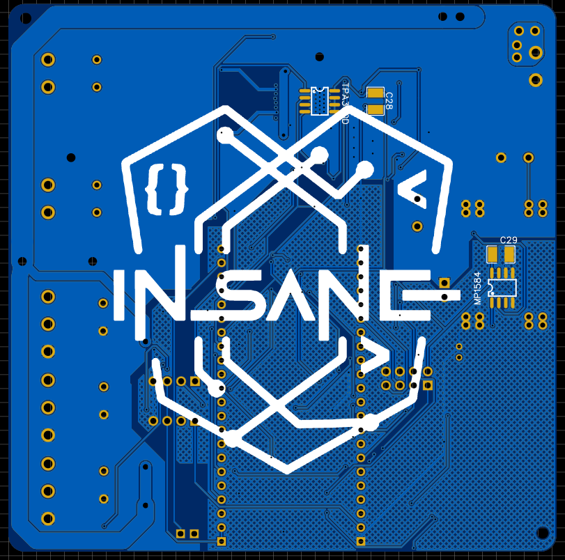
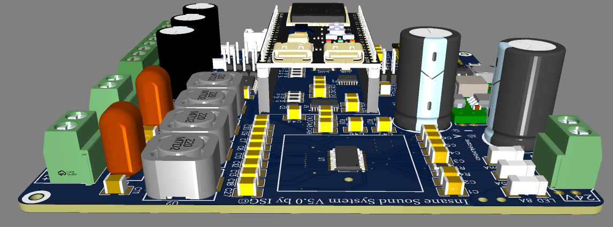

# 🔊 Insane Sound System V5

Willkommen beim **Insane Sound System V5** – dem ultimativen, smarten High-End WLAN & Bluetooth Lautsprecher-Controller!

Monatelange Entwicklung, unzählige Prototypen, Schweiß, Tränen und der unbändige Wille, die absolut perfekte Audio-Zentrale zu erschaffen, sind in diese Platine geflossen. Das **Insane Sound System V5** ist das ultimative Resultat dieses Wahnsinns. 

**Was ist das Insane Sound System überhaupt?**
Es ist nicht einfach nur ein Verstärker-Board. Es ist das kompromisslose, smarte Herzstück für deine selbstgebaute High-End-Audiobox. Es verbindet audiophile Hardware mit der unendlichen Flexibilität von Smart Homes und gibt dir die absolute Kontrolle über Sound, Licht und Hardware – alles auf einer winzigen, professionellen 100x100mm Platine.

### 🔥 Was kann das Teil ALLES?
Dieses Board ist bis unter die Zähne bewaffnet mit Features:
* **Nahtlose Dual-Audio-Quellen:** Streame Musik über WLAN (Home Assistant/ESPHome) oder verbinde dein Handy direkt über Bluetooth. Ein dedizierter Hardware-Multiplexer schaltet verlustfrei und absolut knackfrei zwischen den Audioquellen um.
* **Bluetooth mit Metadaten:** Der Bluetooth-Chip streamt nicht nur Musik, sondern schickt Titel, Interpret, Album und den Play/Pause-Status direkt auf dein Smart-Home-Dashboard.
* **Insane Turbo Mode:** Zu leise? Ein digital schaltbarer Gain-Boost auf Hardware-Ebene holt die maximale Lautstärke aus dem TPA3110-Verstärker heraus.
* **3-Zonen RGB-Lichtshow:** Steuere bis zu drei separate 24V WS28xx-LED-Streifen direkt über die Platine (mit integriertem Level-Shifter für saubere 5V-Datensignale). Inklusive Effekten wie "Knight Rider", "Feuerwerk" oder "Regenbogen".
* **Smartes Thermomanagement:** Drei unabhängige Temperatursensoren (I2C) überwachen Verstärker, Spannungsregler und Gehäusetemperatur. Wird es heiß, regelt das System stufenlos einen 5V-PWM-Gehäuselüfter hoch. Droht der Hitzetod, greift die automatische Notabschaltung.
* **Vollautomatische Stromspar-Logik:** Der Verstärker und der DAC werden hardwareseitig in den Standby (Mute) geschickt, wenn keine Musik spielt. Kein Grundrauschen, kein unnötiger Stromverbrauch.
* **Over-The-Air (OTA) Updates für ALLE Chips:** Flashe nicht nur das Hauptsystem über WLAN, sondern – dank unseres massgeschneiderten Auto-Flasher-Tools – auch den abgetrennten Bluetooth-Chip komplett drahtlos über das Netzwerk!

Diese Version wurde von Grund auf neu entwickelt. Das Ziel: Maximale Audio-Leistung, idiotensichere Bedienung und ein Hardware-Design, das sich professionell fertigen und trotzdem völlig entspannt zu Hause zusammenbauen lässt.



## ✨ Was ist neu in V5? (Hardware & Features)

Wir haben keine halben Sachen gemacht. V5 bringt massive Upgrades unter der Haube:

* **Kompaktes 100x100mm Design:** Die Platine passt in fast jedes Gehäuse und bleibt genau unter der magischen Grenze, um bei PCB-Herstellern extrem günstig bestellt werden zu können. Bessere Thermik und optimales Routing auf kleinstem Raum!
* **Handlötfreundliches SMD-Design:** Das Board besteht zu 90% aus SMD-Bauteilen für kürzere, saubere Signalwege und ein modernes Design. **Keine Panik:** Die kleinsten Bauteile sind strikt auf die **Größe 1206** limitiert! Du brauchst kein Mikroskop und keine ruhigen Chirurgen-Hände, alles lässt sich völlig entspannt von Hand löten.
* **Dual-Brain Architektur:** Ein moderner ESP32-S3 steuert als Haupt-Hirn Home Assistant, WLAN und LEDs. Ein dedizierter ESP32-WROOM-32E kümmert sich *ausschließlich* um verlustfreies Bluetooth-Audio.
* **Echter Hardware-Multiplexer:** Der SN74CB3Q3257 Chip schaltet das I2S-Audiosignal blitzschnell und ohne nerviges Knacken zwischen WLAN (S3) und Bluetooth (WROOM) um.
* **Smartes Temperatur-Management:** Drei TMP102-Sensoren überwachen den Verstärker (TPA3110), die Spannungsregler und die ESP32-Umgebung. Ein 5V-Gehäuselüfter wird stufenlos per PWM gesteuert, sobald es im Gehäuse warm wird.
* **Over-The-Air Bluetooth Updates:** Das WROOM-Modul kann jetzt komplett drahtlos über WLAN geflasht werden. Kein USB-Kabel, kein Schrauben – einfach per Knopfdruck im Dashboard!



---

## 🛒 Einkaufsliste & Bauteile (BOM)

Die komplette und detaillierte Liste aller benötigten Bauteile findest du im Ordner `BOM/` (als Datei `BOM_insane-sound-system-v5_xxxx-xx-xx.csv`). 

Fast alle Standard-Komponenten (wie die 1206 Widerstände, Kondensatoren, ESP-Module und den Verstärker-Chip) kannst du problemlos in vielen Shops bestellen. 

---

## 🛠️ Die idiotensichere Schritt-für-Schritt Anleitung

Jeder kann dieses System bauen. Folge einfach stur diesen Schritten:

### Schritt 1: Hardware löten
1. Bestelle die Platine anhand der Gerber-Dateien im Ordner `Gerber/`.
2. Löte zuerst die SMD-Bauteile (Größe 1206) auf. Beginne mit den flachen Bauteilen (Widerstände, Kondensatoren) und arbeite dich zu den größeren Chips vor.
3. **WICHTIG:** Verlöte das große Masse-Pad (Exposed Pad / EP) auf der Unterseite des ESP32-WROOM zwingend mit der Platine! Das ist nicht nur für die Erdung wichtig, sondern fungiert als essenzieller Kühlkörper. Ohne diese Verbindung überhitzt der Chip.



### Schritt 2: ESPHome vorbereiten (Mainboard S3)
Aus Sicherheitsgründen nutzt dieses Projekt ausgelagerte Passwörter. 
1. Erstelle in deinem Home Assistant / ESPHome-Ordner eine neue Datei namens `secrets.yaml`.
2. Füge exakt diese Struktur mit deinen eigenen, echten Daten ein:
   ```yaml
   api_encryption_key: "DEIN_API_KEY"
   ota_password: "DEIN_OTA_PASSWORD"
   wifi_ssid: "DEIN_WLAN_NAME"
   wifi_password: "DEIN_WLAN_PASSWORT"
   ap_password: "DEIN_FALLBACK_HOTSPOT_PASSWORT"
   ```
3. Lade die Datei `insane-sound-system.yaml` aus dem Ordner `ESPHome/` in dein ESPHome-Dashboard hoch.
4. Schließe den **ESP32-S3** per USB an deinen Rechner an und flashe ihn das allererste Mal ganz normal über das Kabel.



### Schritt 3: Das Bluetooth-Modul flashen (OTA via WLAN)
Sobald dein System läuft und im Netzwerk erreichbar ist, flashen wir den zweiten Chip (den ESP32-WROOM) einfach drahtlos!

1. Öffne dein **Home Assistant Dashboard** und gehe zu den Bedienelementen des Insane Sound Systems.
2. Klicke auf den Button **"WROOM in Flash-Modus setzen"**. Warte ca. 2 Sekunden. Der WROOM-Chip ist nun bereit.
3. **Wähle dein Betriebssystem für das Flasher-Tool:**

   **🪟 Für Windows-Nutzer:**
   * Lade die `UPDATE_BLUETOOTH.bat` aus dem Ordner `Updater/Windows/` herunter.
   * Führe sie per Doppelklick aus.

   **🍎/🐧 Für Mac- & Linux-Nutzer:**
   * Lade die `update_bluetooth.sh` aus dem Ordner `Updater/Linux_Mac` herunter.
   * Öffne ein Terminal, navigiere zur Datei und mache sie ausführbar: `chmod +x update_bluetooth.sh`
   * Starte das Skript mit: `./update_bluetooth.sh`

4. Das smarte Skript fragt dich nun, ob es die aktuellste Firmware und das Flasher-Tool automatisch herunterladen soll. Bestätige mit `J` (Ja).
5. Gib die IP-Adresse deines Insane Sound Systems ein (z.B. `192.168.178.50`).
6. Lehne dich zurück und warte, bis im Terminal in grüner Schrift **"BÄÄÄM! FERTIG!"** steht.

### Schritt 4: Neustart & Genießen
1. Ziehe den Netzstecker deines Insane Sound Systems.
2. Warte exakt **5 Sekunden**, damit sich alle Kondensatoren komplett entladen.
3. Stecke das System wieder ein. 

**Glückwunsch! Dein Insane Sound System V5 ist jetzt voll einsatzbereit!**



---

## ⚖️ Lizenz
Dieses komplette Projekt (Hardware und Software) steht unter der [CC BY-NC-SA 4.0 Lizenz](https://creativecommons.org/licenses/by-nc-sa/4.0/). 
Das bedeutet: Nachbauen und Anpassen für private Zwecke ist ausdrücklich erwünscht, jede kommerzielle Nutzung oder der Verkauf sind strikt verboten!

---

## ☕ Support dieses Projekts
V5 hat extrem viel Zeit, Nerven und Kaffee gekostet. Wenn dir das System gefällt und du meine Arbeit unterstützen möchtest, freue ich mich riesig über einen virtuellen Kaffee!

[Hier klicken zum Spenden (PayPal)](https://www.paypal.me/babeinlovexd)

Jeder Cent fließt direkt in die Entwicklung von V6 und neue Prototypen! 🚀
---

## 👨‍💻 Entwickelt von

| [<br><sub>**Christopher**</sub>](https://github.com/babeinlovexd) |
| :---: |

---


